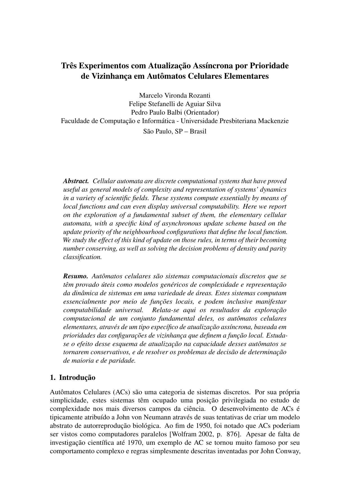
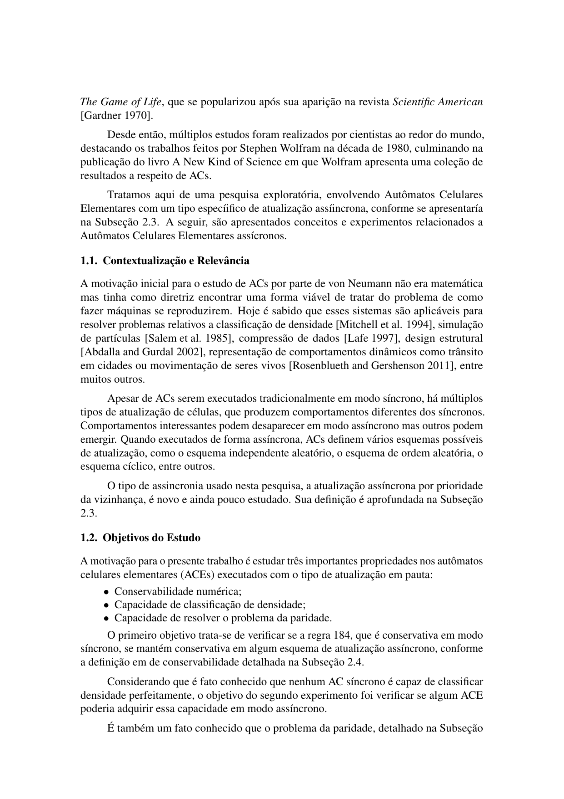
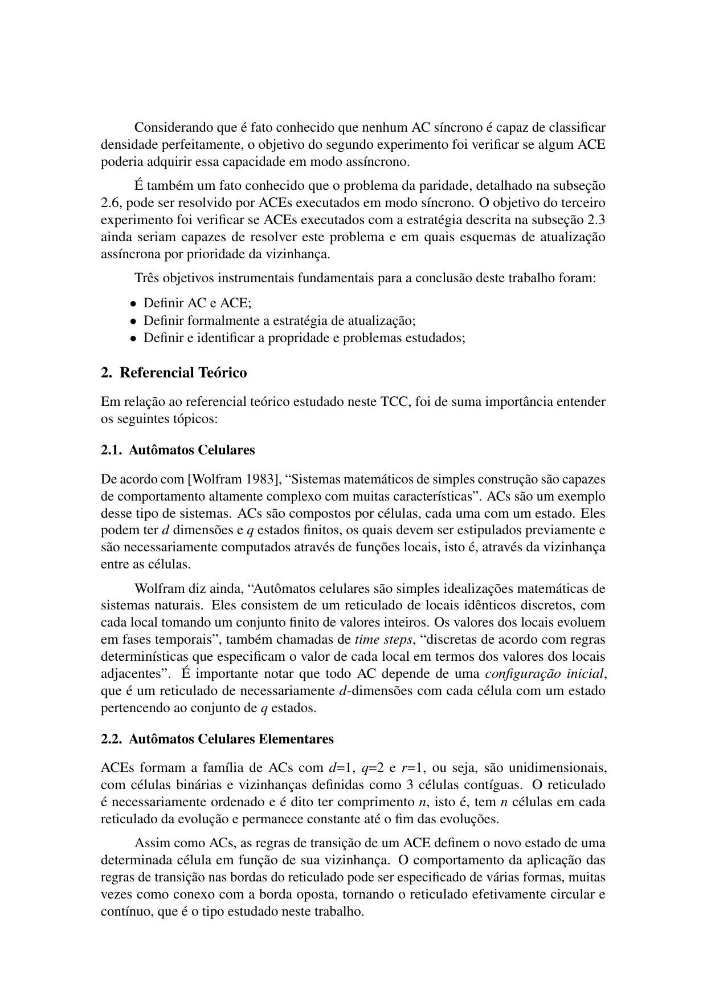
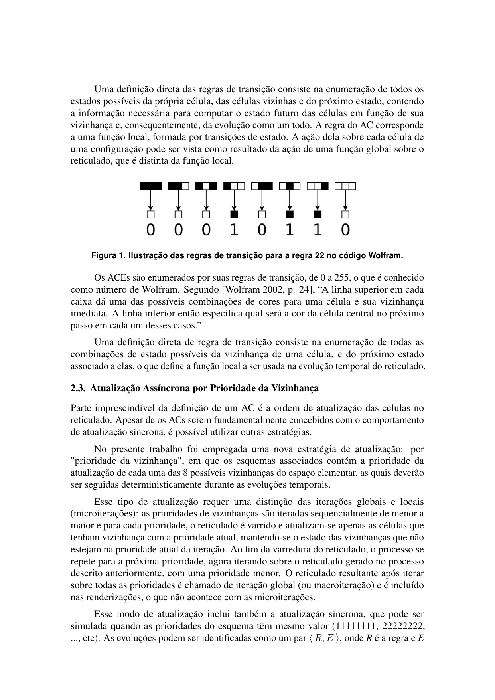
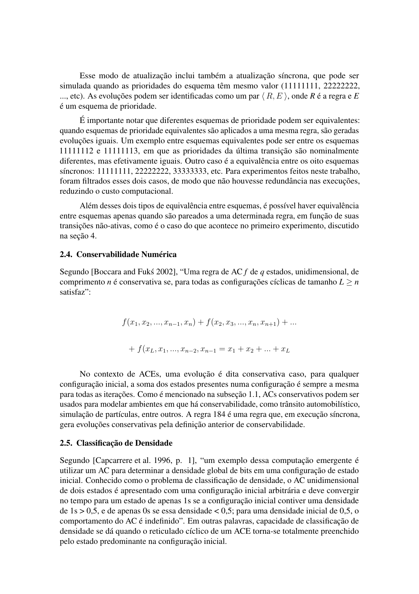
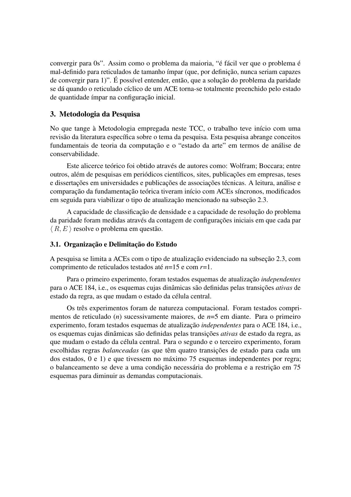
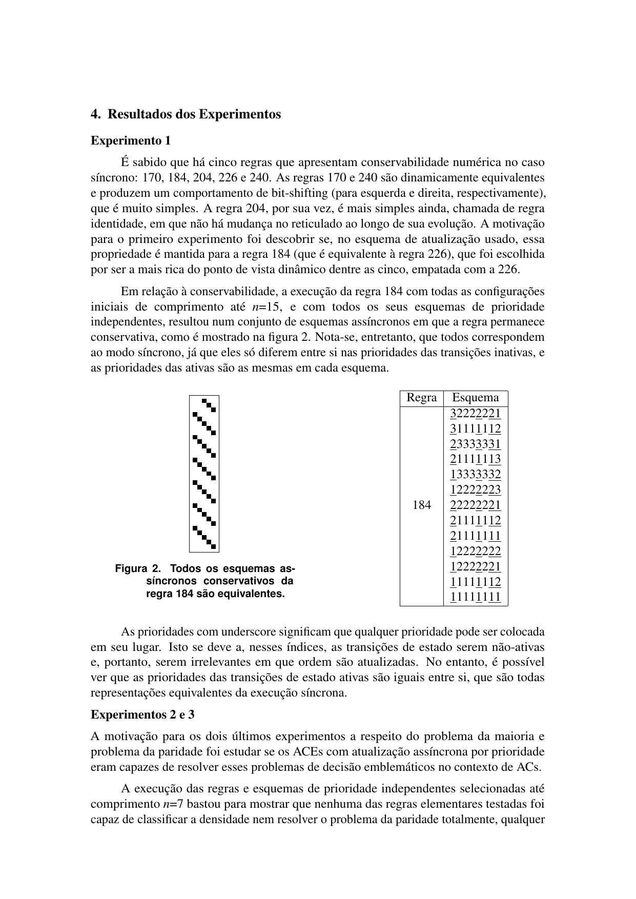
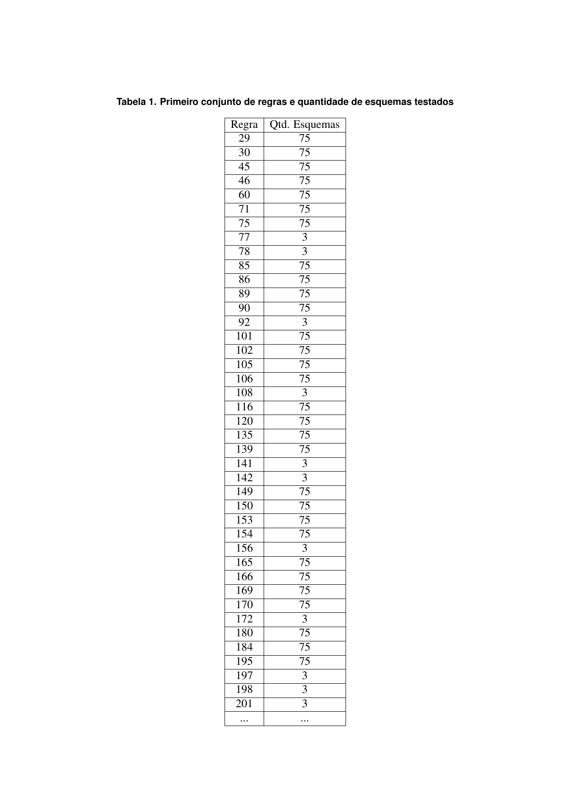
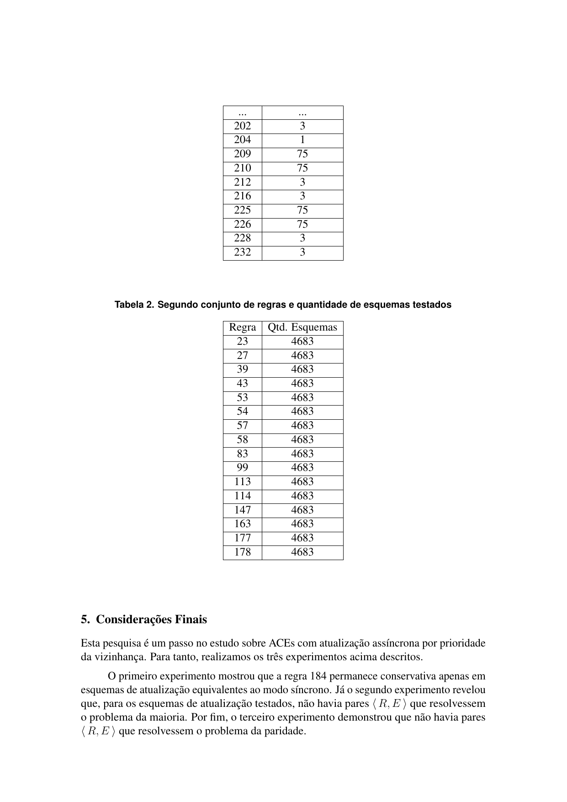
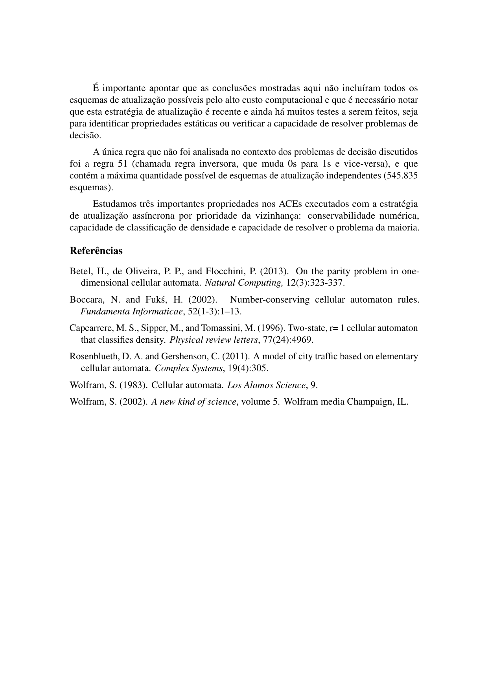

# Main file usage

```
usage: aecaudsn.py [-h] [-n LENGTH] [-t TIMESTEPS] [-r RULE-ID] [-s ASYNCHRONOUS-SCHEME]
                   [-I CONFIG] [-o FORMAT]

Asynchronous Elementary Cellular Automata Update schedule by Neighbourhood priority

This program generates either a txt or a png file of the ECA stated above.

The output filename format is fixed as such: <length>x<timesteps>-<rule>-<scheme>-<initial-configuration>.<png|txt>

optional arguments:
  -h, --help            Show this help message and exit.

  -n LENGTH, --length LENGTH
                        Lattice length, n.

  -t TIMESTEPS, --timesteps TIMESTEPS
                        Timesteps to run, t.
                        Unless specified, this program assumes timesteps=2^length+1.

  -r RULE-ID, --rule RULE-ID
                        Wolfram-code identifier.

  -s ASYNCHRONOUS-SCHEME, --scheme ASYNCHRONOUS-SCHEME
                        Neighborhood priority.
                        Example: 12345678.
                        This argument also supports an irrelevant priority.
                        Theses cases are represented by an underscore, like in 1_1_1_1_.

  -I CONFIG, --initial-configuration CONFIG
                        Initial configuration.
                        Unless specified, this program generates lattices for all possible configurations. The length of CONFIG must match LENGTH parameter.
                        Example: 0001000

  -o FORMAT, --output FORMAT
                        Render to FORMAT file. Valid values are 'txt' and 'png'. Default is 'txt'.
```

# Experiments
To run each of the experiments, simply execute: 

## Experiment 1

`python exp1.py`

The first experiment prints the independent update schemes where rule 184 remains conservative. As it turns out, all of them are equivalent to the synchronous update mode.

## Experiments 2 & 3

`python exp2.py # majority problem`

`python exp3.py # parity problem`

When finishing execution, each of these programs outputs a csv file for each valid (odd and greater than 3) lattice length, where each cell corresponds to a pair of Wolfram-code rule and an asynchronous update scheme. 

The cell value is the amount of initial configurations in which that pair is able to solve the respective decision problem. A pair is perfectly successful for a *n*-length lattice only if it solves the decision problem for all initial configurations.











