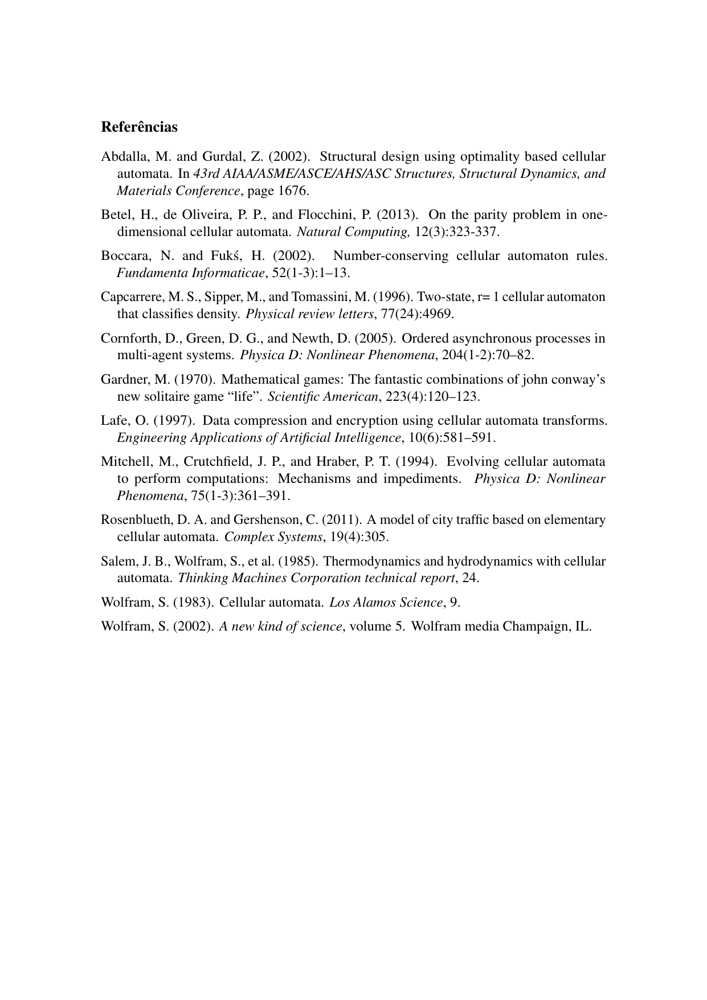

# Usage

```
usage: aecaudsn.py [-h] [-n LENGTH] [-t TIMESTEPS] [-r RULE-ID] [-s ASYNCHRONOUS-SCHEME]
                   [-I CONFIG] [-o FORMAT]

Asynchronous Elementary Cellular Automata Update schedule by Neighbourhood priority

This program generates either a txt or a png file of the ECA stated above.

The output filename format is fixed as such: <length>x<timesteps>-<rule>-<scheme>-<initial-configuration>.<png|txt>

optional arguments:
  -h, --help            Show this help message and exit.

  -n LENGTH, --length LENGTH
                        Lattice length, n.

  -t TIMESTEPS, --timesteps TIMESTEPS
                        Timesteps to run, t.
                        Unless specified, this program assumes timesteps=2^length+1.

  -r RULE-ID, --rule RULE-ID
                        Wolfram-code identifier.

  -s ASYNCHRONOUS-SCHEME, --scheme ASYNCHRONOUS-SCHEME
                        Neighborhood priority.
                        Example: 12345678.
                        This argument also supports an irrelevant priority.
                        Theses cases are represented by an underscore, like in 1_1_1_1_.

  -I CONFIG, --initial-configuration CONFIG
                        Initial configuration.
                        Unless specified, this program generates lattices for all possible configurations. The length of CONFIG must match LENGTH parameter.
                        Example: 0001000

  -o FORMAT, --output FORMAT
                        Render to FORMAT file. Valid values are 'txt' and 'png'. Default is 'txt'.
```
